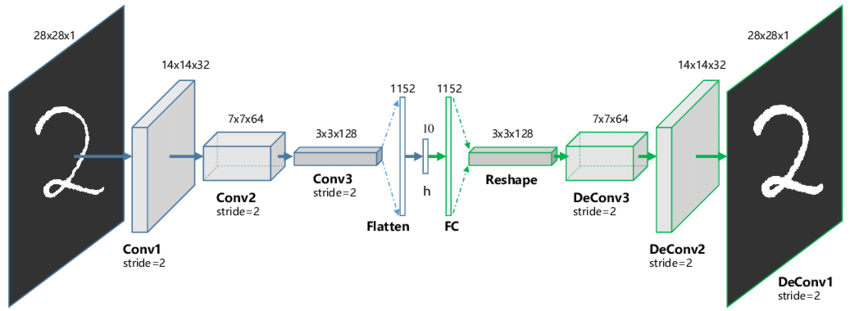

# Introduction

This is the 3rd and final project of Software Development for Algorithmic Problems. In this project, we compare 2 different vector space 
representations for the MNIST dataset, and evaluate how they perform on nearest neighbor search and clustering. 

# Description

## Reducing Data Dimensionality

We used a (mirrored) CNN autoencoder architecture which includes a bottleneck layer in the middle. After training the model, we "feed" each image
to the network as input, we take the output of this bottleneck layer and use it as a new vector representation for this image. In our case, this 
bottleneck layer produces 10 output values so the above procedure can be expressed more formally as a mapping: 784d space --> 10d space:

## NN Search 

### Approximate NN (784d) vs Exact NN (784d) vs Exact NN (10d) 

### Exact k-NN (784d) : Manhattan vs Earth Mover's Distance

In this section, we implemented earth mover's distance and compared it to manhattan distance, our default metric for measuring similarity 
between 2 images up to this point. For each image in the query set, its 10 nns are found using both metrics. The files containing labels 
are used here in order to measure the accuracy of each approach. It turned out that for MNIST, manhattan distance is both more accurate 
and substantially faster.  
To compute the earth mover's distance between 2 images, we had to minimize an objective function with respect to some constraints. For this
purpose, [google or-tools] (https://developers.google.com/optimization) was used.

## Clustering in the 2 Vector Spaces

In this section, we compared 3 different clustering procedures:  
1. clustering in 10d vector space + computing silhouette and objective function in 784d vector space
2. clustering in 784d vector space + computing silhouette and objective function in 784d vector space
3. create clusters using cnn's class predictions for the training set (784d) + computing silhouette and objective function in 784d vector space

The evaluation of each procedure (silhouette and objective) had to be made in the original vector space for our comparisons to make sense. We 
observed that number (1) produced the worst results, which is something we expected because of the reduced dimensionality of the data. Procedures
(2) and (3) performed similarly but (2) achieved slightly higher silhouette score and lower clustering objective value.
